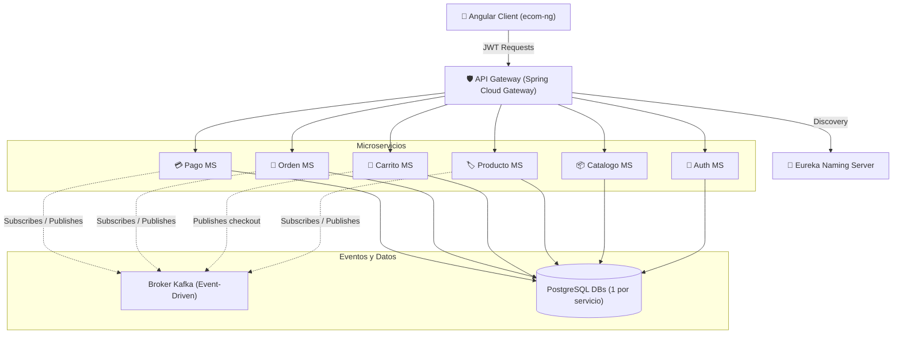

# 🦎 Lizard Store - E-Commerce Platform

Plataforma premium de e-commerce basada en microservicios, diseñada con una arquitectura reactiva dirigida por eventos (Kafka), seguridad centralizada (JWT Gateway), y observabilidad integrada de nivel empresarial.

---

## 🏗️ Arquitectura de la Plataforma

El sistema se compone de múltiples capas organizadas bajo un modelo descentralizado de microservicios:



---

## 🛠️ Stack Tecnológico

### Backend (Microservicios Java)
* **Java 17 & Spring Boot 3.x**
* **Spring Cloud Suite**: Spring Cloud Gateway, Eureka Service Discovery, Spring Cloud Config Server.
* **Mensajería Asíncrona**: Apache Kafka (Eventos distribuidos).
* **Bases de Datos**: PostgreSQL (Almacenamiento individualizado por servicio con Flyway Migrations).
* **Seguridad**: Stateless JWT Authentication, CORS Global.

### Frontend (Client App)
* **Angular 17+**: Arquitectura de Standalone Components, Reactive Forms y State Management.
* **Diseño UI**: CSS Puro con estilización Premium y Glassmorphism.
* **Integración SDK**: MercadoPago SDK v2 (Wallet Brick integrado para pagos de prueba en Sandbox).

### Observabilidad & Monitoreo
* **Grafana**: Dashboard unificado.
* **Prometheus**: Recolección de métricas a través de endpoints de Actuator.
* **Loki & Promtail**: Centralización e indexación de logs de consola de todos los microservicios.

---

## ✨ Características Especiales e Implementaciones Avanzadas

### 1. Control Automático y Reactivo de Stock
El stock de productos se administra de forma reactiva y consistente mediante eventos de Kafka:
- Cuando el usuario realiza el pago y MercadoPago confirma la transacción, `pago-ms` emite un evento `pago.realizado`.
- `orden-ms` consume este evento, confirma la orden y publica `orden.confirmada` adjuntando el detalle de cada artículo comprado.
- `producto-ms` consume de forma asíncrona `orden.confirmada` y reduce el stock del inventario automáticamente en base a las cantidades del pedido, evitando ventas sin existencias reales.

### 2. Historial de Órdenes Protegido por Usuario
El historial de pedidos se encuentra protegido a nivel de API:
- Las consultas son relativas al identificador único de usuario autenticado en la sesión de Angular (`AuthService`).
- El endpoint `GET /api/v1/ordenes/usuario/{usuarioId}` garantiza que un cliente solo pueda consultar sus propias órdenes.

### 3. Selector y Buscador Premium de Categorías
- **Selector de Productos**: El antiguo selector por chips horizontales se reemplazó por un dropdown premium interactivo que cuenta con un buscador en tiempo real incorporado.
- **Buscador de Categorías**: Se incorporó un buscador interactivo en la sección de administración y catálogo de categorías para filtrar por nombre y descripción de forma dinámica.

### 4. Integración Segura con MercadoPago Sandbox
Para sortear las limitaciones de red en entornos locales (donde los webhooks externos de MercadoPago no pueden alcanzar puertos locales `localhost` sin túneles como ngrok):
- **Búsqueda Activa (Active Polling)**: Al ingresar al listado de órdenes en el cliente frontend, el servicio [pago-ms](file:///services/pago-ms) realiza una búsqueda activa consultando directamente el estado de los pagos asignados a la orden en las APIs oficiales de MercadoPago.
- **Bypass de Deserialización del SDK**: Para evitar caídas causadas por inconsistencias del SDK oficial de Java (error `java.lang.IllegalStateException: Expected BEGIN_OBJECT but was STRING`), las consultas de pago se ejecutan a través de llamadas HTTP directas con `RestTemplate` mapeadas a estructuras genéricas `Map<String, Object>`.
- **Monto Backup**: Para prevenir errores 404 por inicialización tardía de la base de datos de pagos, el sistema genera perezosamente el registro del pago con el parámetro `monto` proveniente del frontend cuando es necesario.

---

## 🚪 Puertos de Servicios en Desarrollo (DEV)

| Servicio / Componente | URL | Propósito |
| :--- | :--- | :--- |
| **Frontend App** | `http://localhost:4200` | Interfaz de Usuario Angular |
| **API Gateway** | `http://localhost:18080` | Entrada centralizada de peticiones |
| **Config Server** | `http://localhost:18888` | Servidor de configuración central |
| **Eureka Server** | `http://localhost:18761` | Servidor de descubrimiento de servicios |
| **Kafka UI** | `http://localhost:41085` | Panel de control de temas y mensajes Kafka |
| **Grafana** | `http://localhost:13000` | Tablero de visualización de logs/métricas |
| **Prometheus** | `http://localhost:19090` | Motor de base de datos de métricas de salud |
| **Loki** | `http://localhost:13100` | Motor de logs indexados |

---

## 🚀 Guía de Inicio Rápido (Entorno Local)

### Requisitos Previos
* **Docker Desktop** activo.
* **Java 17 (JDK)** configurado.
* **Maven** instalado (o usando el wrapper `./mvnw` incluido).
* **Node.js (v18+)** e **npm**.

### Paso 1: Inicialización Automatizada (Recomendado en Windows)
En la raíz del proyecto encontrarás el script por lotes automatizado que se encarga de crear las redes, compilar e iniciar los servicios de docker y los microservicios en ventanas de terminal individuales:

```powershell
.\start-dev.bat
```

### Paso 2: Inicialización Manual (Paso a Paso)

1. **Crear la Red de Docker**:
   ```powershell
   docker network create lizard-dev-net
   ```

2. **Levantar Kafka e Infraestructura de Observabilidad**:
   ```powershell
   docker compose -f compose-dev.yml up -d
   ```

3. **Iniciar las Bases de Datos de los Microservicios**:
   ```powershell
   cd services/auth-ms && docker compose -f compose-dev.yml up -d
   cd ../catalogo-ms && docker compose -f compose-dev.yml up -d
   cd ../producto-ms && docker compose -f compose-dev.yml up -d
   cd ../carrito-ms && docker compose -f compose-dev.yml up -d
   cd ../orden-ms && docker compose -f compose-dev.yml up -d
   cd ../pago-ms && docker compose -f compose-dev.yml up -d
   cd ../..
   ```

4. **Ejecutar la Infraestructura de Spring (En terminales separadas)**:
   ```powershell
   cd infra/config && ./mvnw spring-boot:run
   cd ../eureka && ./mvnw spring-boot:run
   cd ../gateway && ./mvnw spring-boot:run
   ```

5. **Ejecutar los Microservicios (En terminales separadas)**:
   ```powershell
   cd services/auth-ms && ./mvnw spring-boot:run
   cd ../catalogo-ms && ./mvnw spring-boot:run
   cd ../producto-ms && ./mvnw spring-boot:run
   cd ../carrito-ms && ./mvnw spring-boot:run
   cd ../orden-ms && ./mvnw spring-boot:run
   cd ../pago-ms && ./mvnw spring-boot:run
   ```

6. **Levantar el Frontend Angular**:
   ```powershell
   cd clients/ecom-ng
   npm install
   npm run start
   ```

---
*Lizard Store*

